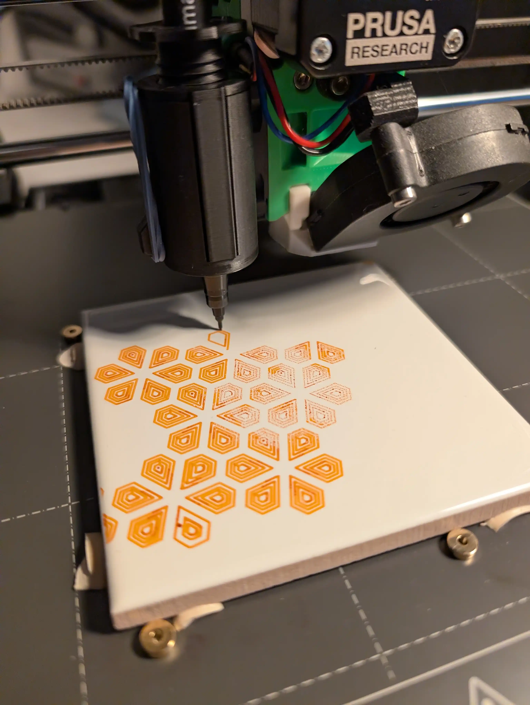
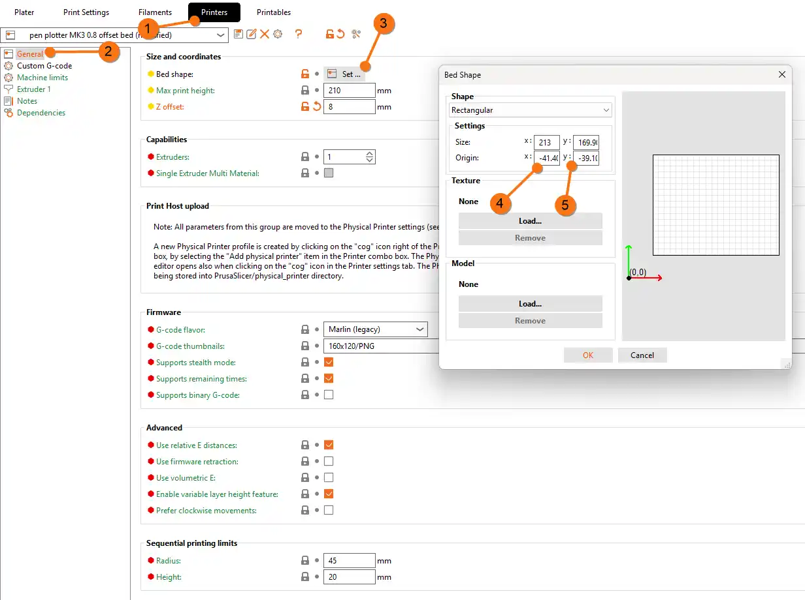
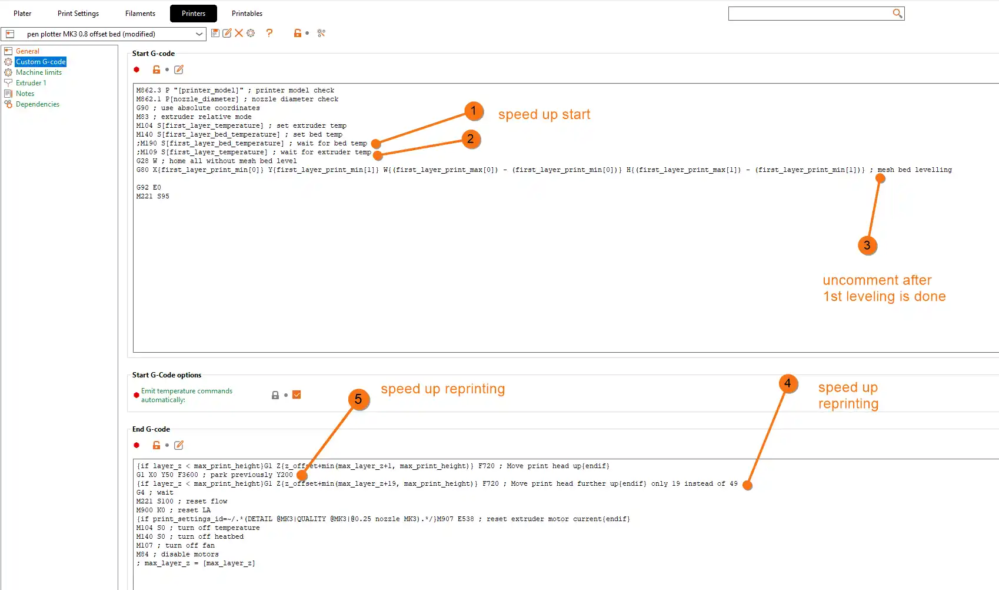
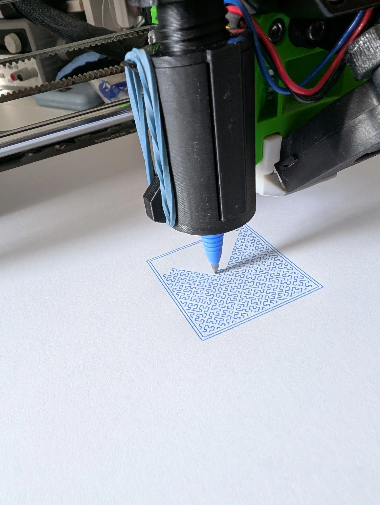
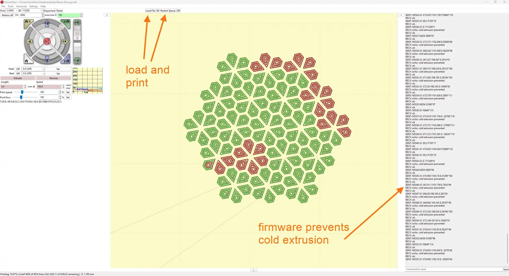
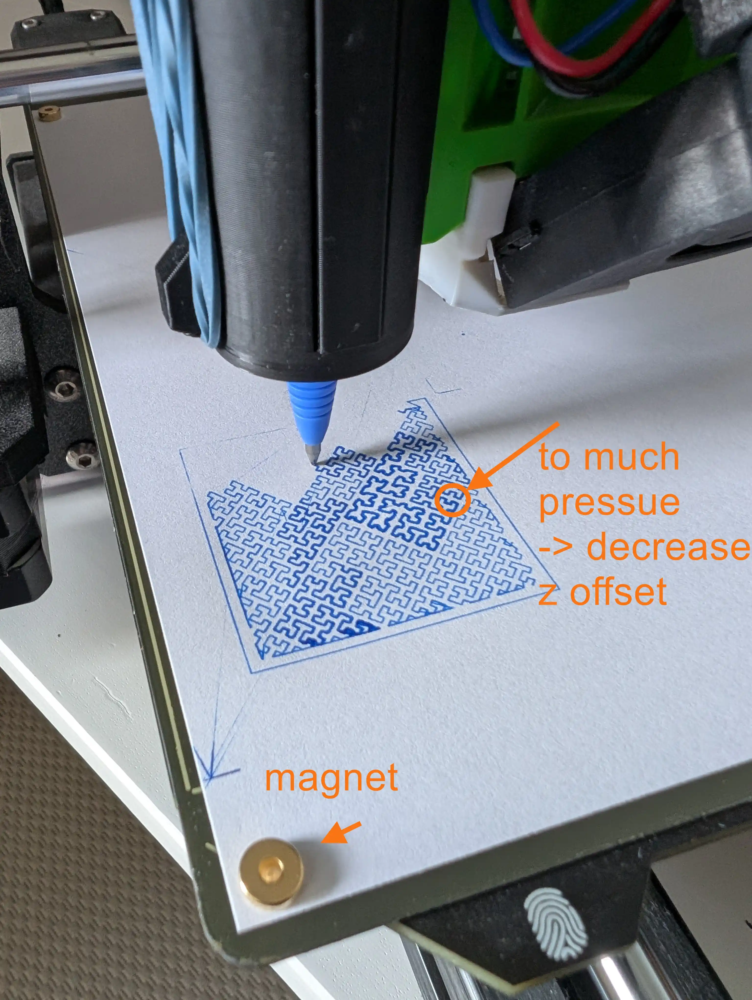
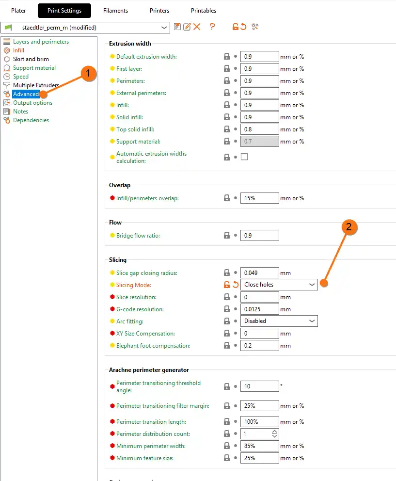

# Penplotter
Experiments using an old 3D printer as a pen plotter, heavily drawn from [https://github.com/brianlow/plotter](https://github.com/brianlow/plotter). Have a look at [Flower](https://github.com/brianlow/plotter/tree/main/flower) for the pattern shown below

2D plotter from a Prusa 3D Printer
===
## General operating mode

If you already have PrusaSlicer installed, you’re ready for a quick start

* Use Prusa Slicer for gcode generation from an existing SVG
    * alternativly: Generate text and shapes directly with the slicer
* Use SD Card or Pronterface (via USB) to transfer gcode
  * Pronterface offers a 2-click start solution. (Pronterface is a tool which comes with PrusaSlicer if you choose to install it.)
    

## Printer preparation

* Print and add plotter holder [https://www.printables.com/model/63385-pen-plotter-attachment-for-prusa-mk3s](https://www.printables.com/model/63385-pen-plotter-attachment-for-prusa-mk3s)
* Lower PINDA Sensor to accommodate for the 10mm longer pen tip (optional but recommended)
* Perform a first layer calibration on thick paper (if PINDA was moved)
    * Issue: bed heats up to 50°C and warps your first paper
    * Only needs to be done once

## Slicer Settings

### New Filament Profile
* Copy PLA Profile
* Change Temperature to something safe (reduce burn risk) like
    * Nozzle: 40°C (above room temperature, if lower, printer will not start)
    * Bed: 20°C
* Set z hop to 1-2mm (Filament Overrides -> Lift height) - to prevent travel moves from being drawn on uneven paper

### New printer profile
* Move origin by X:-41.40 Y:-39.10 by setting the bed origin to those values (and reduce bed size accordingly) to account for the pen being at an offset

* Remove intro line (start gcode) as it sometimes collides with paper holder and is unnecessary anyway
* Removal of mesh bed leveling is not recommended but possible

### New print settings
* Change Infill->Bottom Fill pattern to fill boxes and other shapes interestingly, e.g. with Hilbert curves

## Workflow
* Load SVG into slicer, set height to one layer (0.2mm)
* Slice gcode
* Save to disk
* Remove cap from pen (if not: homing will not work due to crash)
* Transfer to printer
    * via SD card
    * via Pronterface: Load gcode, click print
        * On main screen: Button "load file"
        * "Print"-Button to start the print
        
* Do Live-Z adjustments for perfect line width from the printer's menu. Greatly improves visual appearance of the lines. Too much force adds too much thickness and unevenness, especially at corners

## Improvements
* Add a marlin pause command to Prusa Slicer, so you can adjust the pen or even add the pen right at the start of the plot for adjustment
* Do a calibration
    * With Pronterface move loaded pen to lower left corner
        * Result: X:41.40 Y:39.10
        * Create Printer Profile with Offset Bed Origin at X:-41.40 Y:-39.10 and place objects on grey bed area
    * Upper right corner is still X=255, Y=209 (obviously) but usable size is smaller
    * z: Moving PINDA probe so that a z=0 equals not touching the paper but 1mm above. Then adjust via live-z to z=-1mm the actual printing. That way bed leveling does not draw but actual drawing does
        * note: printer cannot move below z=0, so live-z has to do it. One cannot set a z offset to go below 0, but positive z-offset can account for paper or tile thickness, e.g., a ceramic tile has 7mm thickness

        
## Issues
* Use first text marker, then fine line. The other way around, text marker smears
* Beware of the offset of the different holders. A thinner pen has another y-coordinate than a thicker pen. This creates an offset on the paper if the clamping holder is used instead of the auto-centering
* Mesh bed leveling should not draw, but an incorrect z of the pen holder can create unwanted lines. Be extra careful when inserting the pens
  * Hack: pause a print and then insert the holder and tighten the screws, adjust z height of the pen
* Slicing mode->Close holes can help with filigree details

* Printing on high objects (e.g., a tile of 7mm height)
    * Bed leveling and PINDA will collide with tile, so 
        * Generate gcode with a z-offset of 8mm
        * Start print, pause on first line after leveling
        * Add tile
        * Insert and adjust pen to correct height (which is 7mm higher than usual)
    * Perfect bed leveling and repeatability; only attach tile after leveling
    * Printing at 200% speed is also fine

## Links and further reading
* [https://github.com/brianlow/plotter](https://github.com/brianlow/plotter)
* [https://www.printables.com/model/63385-pen-plotter-attachment-for-prusa-mk3s/comments](https://www.printables.com/model/63385-pen-plotter-attachment-for-prusa-mk3s/comments) 
    * especially [https://www.printables.com/make/557511](https://www.printables.com/make/557511)
* [https://github.com/SonarSonic/DrawingBotV3](https://github.com/SonarSonic/DrawingBotV3)
* [https://plotterfiles.com](https://plotterfiles.com)
* [https://github.com/beardicus/awesome-plotters](https://github.com/beardicus/awesome-plotters)
* Generative art and sharing: [https://turtletoy.net/turtle/browse/love/](https://turtletoy.net/turtle/browse/love/)